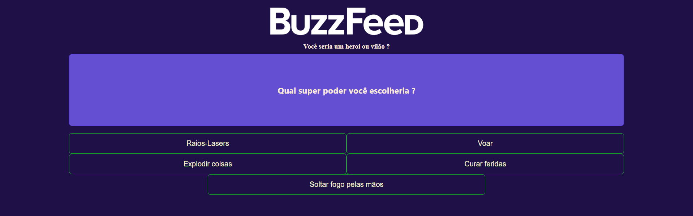

# Clone BuzzFeed

Clone desenvolvido no desafio da Digital Innovation One para finalização do bootcamp "Potência Tech Angular Developer - Powered by iFood"

## Instalação
• Baixar arquivos desse repositório•  
• Abrir proMpt de comando ( ou alguma CLI de sua preferencia) na pasta do projeto•  
• Executar ( no prompt ) o comando "npm install && npm run start"•  
• Após a instalação dos pacotes execute o comando  "npm run start" para iniciar a aplicação•  

## Modo de uso
• Após a instalação dos pacotes e a inicialização do projeto acesse "http://localhost:4200" e se divirta!

## Tecnologías
• Angular

## Licença
ISC

## Créditos
Danilob.serafim@gmail.com

